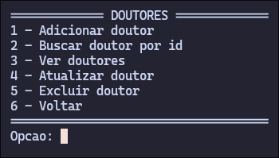
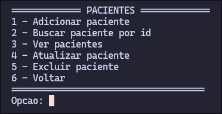
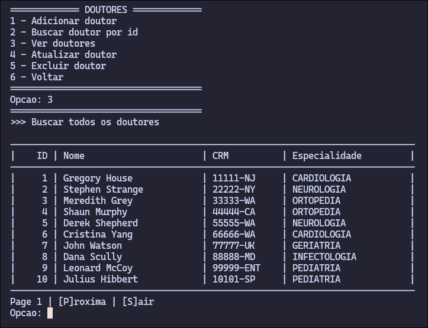
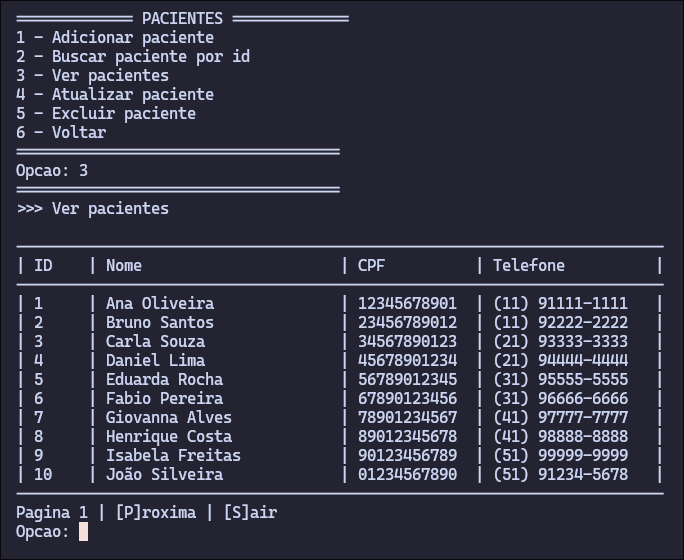
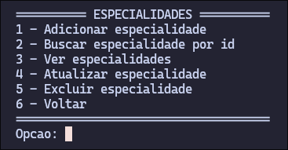
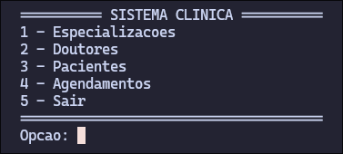
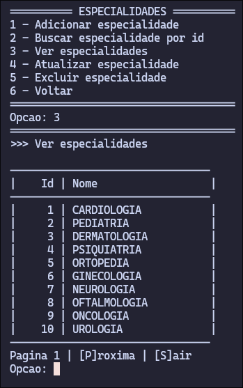
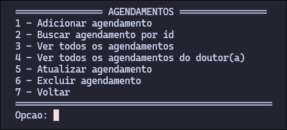
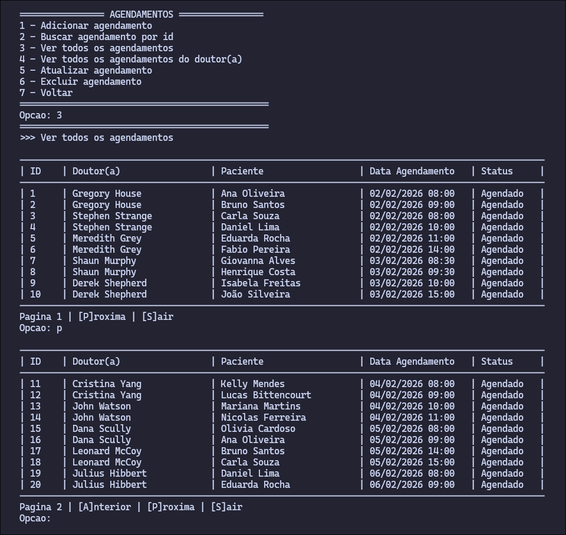

<div align="center">
  <h1>Medical Clinic (JDBC) 🩺</h1>
  <p>Gestão de clínica médica com persistência em banco de dados relacional, arquitetura em camadas e validações de negócio complexas.</p>
</div>

---

## 📌 Sumário
- [🛠️ Implementação Técnica](#️-implementação-técnica)
- [🧠 Diferenciais do Projeto](#-diferenciais-do-projeto)
- [📸 Visual do Sistema](#-visual-do-sistema)
- [🚀 Como Executar](#-como-executar)

---

## 🛠️ Implementação Técnica

### 🏗️ Arquitetura e Padrões
- `DAO Pattern`: Encapsulamento da persistência e isolamento de queries.
- `Connection Factory`: Singleton para gestão centralizada de conexões JDBC.
- `Separação em Camadas`: Arquitetura limpa dividida em View (CLI), Service (Regras) e Repository (DAO).

### 🗄️ Persistência (JDBC)
- `PreparedStatement`: Proteção nativa contra SQL Injection.
- `Try-with-resources`: Gestão eficiente de recursos e fechamento automático de conexões.
- `Time API`: Uso intensivo de `LocalDateTime` para manipulação de datas e horas.

---

## 🧠 Diferenciais do Projeto

### 🛡️ Validações de Negócio (Business Rules)
Diferente de um CRUD comum, este sistema implementa regras críticas na camada `Service`:
- **Intervalo de Segurança**: Garante um intervalo mínimo de **15 minutos** entre consultas do mesmo médico utilizando a `Java Time API (Duration)`.
- **Prevenção de Retroatividade**: Impede agendamentos em datas passadas.
- **Conflito de Agenda**: Travas de segurança via banco (`Unique Constraints`) e lógica de aplicação para evitar que médico ou paciente tenham conflitos de horário.

### 🗄️ Tratamento Avançado de Persistência
- **Mapeamento de Erros SQL**: Conversão de códigos de erro nativos (ex: `1062` para duplicidade e `1452` para chaves estrangeiras) em exceções de negócio legíveis via análise de mensagens (`String.contains`).
- **Arquitetura DAO**: Isolamento total do SQL. A camada de serviço consome apenas objetos de domínio, garantindo alta manutenibilidade.

---

## 📸 Visual do Sistema

### 📂 Tour pelos Módulos
O sistema é dividido em módulos independentes com interfaces padronizadas e tabelas formatadas para o terminal.

| Módulo de Médicos | Módulo de Pacientes |
|---|---|
|  |  |
|  |  |

| Módulo de Especialidades | Navegação e Menus |
|---|---|
|  |  |
|  |  |

### 📅 Módulo de Agendamentos
O coração do sistema, contando com listagem paginada e SQL Joins para consolidar dados de médicos e pacientes em uma única visão clara.


---

## 🚀 Como Executar

### Pré-requisitos
1. Instale o **MySQL**.
2. Crie o banco utilizando o script contido em `/sql/setup.sql`.
3. Adicione o driver `mysql-connector-j` na pasta `/lib`.

### Comandos de Compilação e Execução
```bash
# Clonar o projeto
git clone https://github.com/uallace-macedo/medical-clinic-jdbc.git

# Compilar o projeto
javac -cp "lib/*" -d bin src/**/*.java

# Executar (Linux/Mac)
java -cp "bin:lib/*" com.uallace.clinic.Main

# Executar (Windows)
java -cp "bin;lib/*" com.uallace.clinic.Main
```